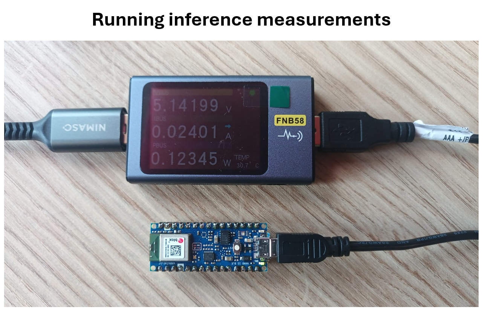

# Running int8 DAE model (quantized) on Arduino Nano 33 BLE board

Running deep learning auto encoder on Arduino Nano 33 BLE          

         

TensorflowLite library should be added to the Arduino IDE (library Zip file is included in library folder) or can be downloaded from: https://github.com/tensorflow/tflite-micro-arduino-examples            

To run the model on the arduino Nano 33 BLE device, use the program named arduino_dae_eeg       

## Results     

- Runtime: single inference time (invoke method) took 1.342 seconds.    

- Power measurements:       
VBUS = 5.13 V       
IBUS = 0.0240 A = 24 mA       
PBUS = 0.123 W = 123 mW       

A sample of the cleaned signal with the runtime measurement is provided in Results_sample.txt          

  
