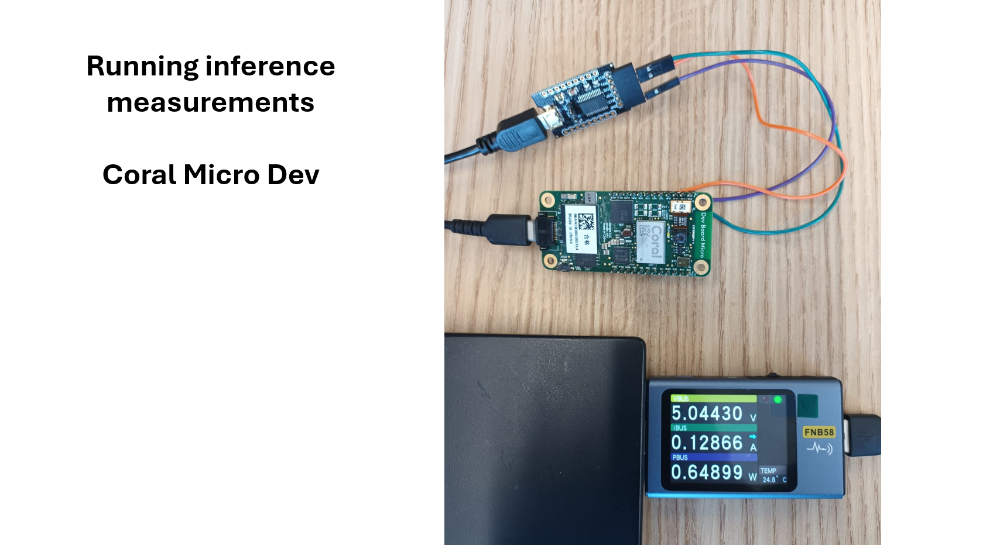

# Running DAE model (quantized) on Coral Dev Micro board

Refer to https://coral.ai/docs/dev-board-micro/get-started/#4-set-up-for-freertos-development to setup the programming environment.   

     

## The main steps are:     

1-  git clone --recurse-submodules -j8 https://github.com/google-coral/coralmicro      

2- cd coralmicro && bash setup.sh

3- bash build.sh    

After bulding all examples, download the folder tflm_hello_world and replace with it the existing tflm_hello_world folder in the examples.       

to compile and flash the code to the Coral Dev board, use the following:

make -C build/examples/tflm_hello_world

python3 scripts/flashtool.py -e tflm_hello_world       

If the flashtool did not work, install the required packages. The Arduino IDE could be used to view the results in the serial monitor application (instructions for adding support to micro boards are available on the getting started page). Other applications such as screen on linux could be used to monitor the serial port.     

## Results:      

- The results are displayed on the serial monitor.
- The single inference time (invoke method) on the Coral Dev Micro is: 273 ms             

Power measurements:     
VBUS = 5.04 V       
IBUS = 0.128 A = 128 mA            
PBUS = 0.648 W = 648 mW         
