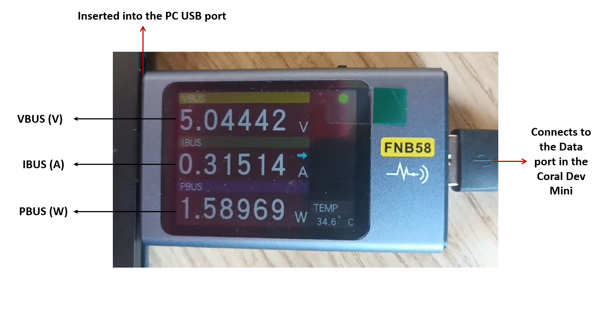

# Running deep learning auto-encoder models on embedded systems

## Introduction   
In this demo, we explain how to run ML models on embedded systems:      

1- Coral Dev Board Mini   

## run_tflite.py
The "run_tflite.py" script demonstrates how to use a TensorFlow Lite (TFLite) model to perform inference on noisy test data.
The main steps are summarized by the following:   
1- Import the necessary libraries: "numpy", "tensorflow", and "os"   
2- Get the current path and combine it with the filenames to create the full path of the model and the data files   
3- Loads the data using "np.load"   
4- Loads the TFLite model and allocate tensors    
5- Gets the input and output details from the interpreter     
6- Converts the x_text_noisy data to np.float32 and stores them in text_data    
7- For each sample in the test data do the following:       
a- Reshape the sample to match the input tensor shape of the TFLite model      
b- Set the input and invoke inference      
c- Retreive the output and store in the results       
8- Convert the results into a Numpy array and store in another variable (decoded_layer)     
9- Print the decoded_layer (results of the inference)  

## Run the model on the Coral Dev Board Coral_mini_text
1- Connect the board to a Linux-based PC through the data cable only    
2- Use a USB voltage and current detection meter (such as FNB58 USB tester) to monitor the current through the USB cable (optional)         
3- Wait for the board LED to show green color indicating the that the boot process was completed successfully     
4- Open terminal and run: mdt devices (This should return the name and IP of the connected board)      
5- Use the command "mdt shell" to open a shell on the board using the MDT tool (Managed Device Tool). This starts an interactive shell session on the target device, allowing you to execute commands directly on the board.     
6- Use the command "nmtui" to open a GUI for configuring the internet connection on the board.        
7- Download the GitHub repo to execute the code (use git clone)     
8- Run the "run_tflite.py" script

## Results
- The results are stored in "Results.xlsx" file
- In summary, running the inference on the Coral Dev mini board took an average inference time of 28.41 seconds to complete processing 1712 samples included in the testing dataset (with 800 elements each).    
- For comparison, we ran the same script on a PC obtaining an average inference time of 0.9 seconds. (Processor: Intel® Core ™ i7-1075 CPU @ 2.60GHz. 2592 Mhz, 6 Cores, 12 Logical Processors)
- The power measurements perfomed using the USB-monitoring device showed that the inference process running on the Coral Dev mini board caused an increase in the average power consumption of 0.59 W and an increase in average current consumption of 0.15 A.
- A snapshot of the measurement process is shown below.

